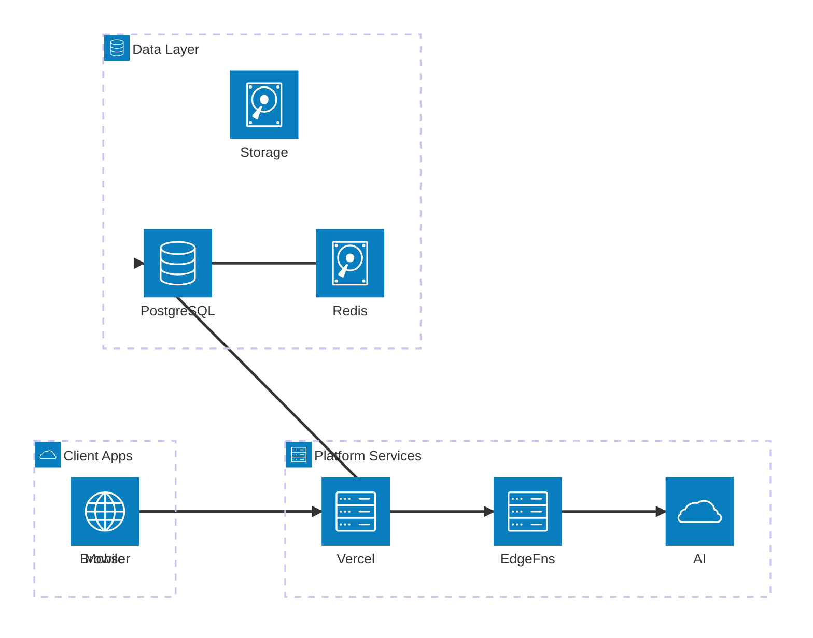
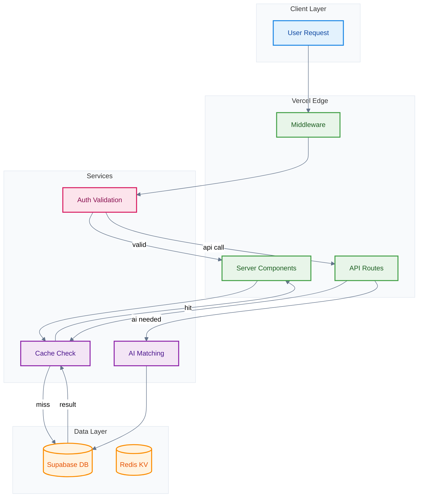
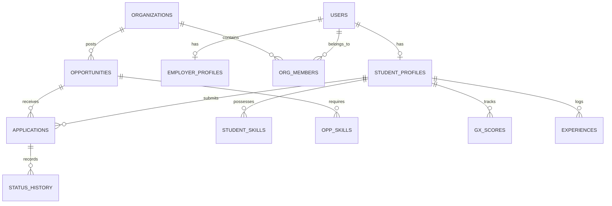

# Technical Architecture Document

- **Project:** Global Talent & Mobility Platform (GlobalXcelerate)
- **Version:** v1
- **Owner:** Rajesh globalxcelerate.ae
- **Last Updated:** 2026-08-16

---

## 1. Executive Summary

GlobalXcelerate is a premium B2B2C SaaS platform enabling students to create a unified global profile powering access to internships, exchange programs, immersion programs, industry projects, scholarships, research opportunities, and graduate careers. The platform connects students, universities, employers, and program providers through AI-powered matching, a Global Employability Score, and a contextual Career Copilot.

**Architecture Principles:**
- **RSC-First**: Server Components by default; client components only for interactivity
- **Edge-Optimized**: Deploy at the edge via Vercel for global low-latency access
- **RLS-Enforced Multi-Tenancy**: Row Level Security on every table; no shared data leakage
- **AI-Augmented**: Server-side AI integration with circuit breakers and graceful degradation
- **Mobile-First Responsive**: Single codebase serving all breakpoints (320px → 1536px+)

**Key Technology Decisions:**

| Layer | Technology | Rationale |
|-------|-----------|-----------|
| **Frontend** | Next.js 14+ (App Router) | RSC, streaming, ISR, file-based routing |
| **Language** | TypeScript 5+ (strict) | Type safety, refactoring confidence |
| **Styling** | Tailwind CSS 3+ + shadcn/ui | Utility-first, accessible, consistent |
| **Database** | Supabase PostgreSQL 15+ | RLS, JSONB, full-text search, realtime |
| **Auth** | Supabase Auth | Multi-provider OAuth, JWT, MFA |
| **Storage** | Supabase Storage | S3-compatible, signed URLs, CDN |
| **Real-time** | Supabase Realtime | WebSocket channels, presence |
| **AI/LLM** | OpenAI GPT-4 / Anthropic Claude | Matching explanations, Copilot chat |
| **Hosting** | Vercel | Edge network, auto-scaling, Next.js native |
| **Caching** | Vercel KV (Redis) | Cross-request caching, rate limiting |
| **Charts** | Recharts | Responsive SVG charts, radar/radial |
| **Forms** | React Hook Form + Zod | Performant validation, schema-driven |

---

## 2. System Overview

### 2.1 High-Level Architecture

The system follows a **layered architecture** with clear separation between presentation, application, domain, and infrastructure layers:

1. **Client Layer** — Next.js App Router (RSC + Client Components) served from Vercel Edge
2. **API Layer** — Next.js Route Handlers (`/api/v1/*`) for orchestration and validation
3. **Edge Functions Layer** — Supabase Edge Functions for compute-heavy operations (AI matching, score calculation)
4. **Data Layer** — Supabase PostgreSQL with RLS, Supabase Storage, Vercel KV (Redis)
5. **External Services** — OpenAI/Anthropic APIs, email providers, analytics

### 2.2 Multi-Role Architecture

| Role | Route Group | Primary Features |
|------|-------------|-----------------|
| **Student** | `(student)` | Dashboard, profile, portfolio, marketplace, applications, copilot |
| **Employer** | `(employer)` | Dashboard, opportunity management, candidate search, applications |
| **University Admin** | `(university)` | Institutional dashboard, student management, analytics, programs |
| **Program Provider** | `(provider)` | Program management, participant tracking, opportunity creation |
| **Platform Admin** | `(admin)` | User management, moderation, analytics, system configuration |
| **Public** | `(public)` | Landing, about, pricing, public profiles, public portfolios |

---

## 3. Visual Diagrams

### System Architecture Overview



The architecture separates concerns into three tiers: client applications (browser/mobile) connect to Vercel-hosted Next.js which orchestrates between Supabase Edge Functions (for AI/compute) and the data layer (PostgreSQL + Storage + Redis cache).

---

### Request Data Flow



Every request flows through Vercel Edge middleware for authentication, then branches to either Server Components (page renders) or API Routes (mutations/actions). The cache layer (Redis KV) intercepts reads before hitting PostgreSQL, while AI-dependent operations route through Edge Functions.

---

### Entity Relationship Diagram



The data model centers on `student_profiles` and `opportunities` as the two primary entities, linked through `applications`. Organizations own opportunities and contain members. The GX Score system and skill matching operate on denormalized skill tables for performance.

---

## 4. Application Structure

### 4.1 Next.js App Router File Architecture

```
src/
├── app/
│   ├── (public)/                    # Public marketing pages
│   │   ├── page.tsx                 # Landing page (SSG)
│   │   ├── about/page.tsx           # About (SSG)
│   │   ├── pricing/page.tsx         # Pricing (SSG)
│   │   ├── student/[username]/      # Public student profile (ISR)
│   │   └── layout.tsx               # Public layout (no sidebar)
│   ├── (auth)/                      # Authentication flows
│   │   ├── login/page.tsx
│   │   ├── register/page.tsx
│   │   ├── role-select/page.tsx
│   │   ├── forgot-password/page.tsx
│   │   ├── verify-email/page.tsx
│   │   └── layout.tsx               # Auth layout (centered card)
│   ├── (student)/                   # Student dashboard (protected)
│   │   ├── dashboard/page.tsx
│   │   ├── profile/page.tsx
│   │   ├── portfolio/page.tsx
│   │   ├── applications/page.tsx
│   │   ├── applications/[id]/page.tsx
│   │   ├── marketplace/page.tsx
│   │   ├── marketplace/[id]/page.tsx
│   │   ├── gx-score/page.tsx
│   │   ├── messages/page.tsx
│   │   ├── settings/page.tsx
│   │   ├── onboarding/page.tsx      # 8-step wizard
│   │   └── layout.tsx               # Student sidebar layout
│   ├── (employer)/                  # Employer dashboard (protected)
│   │   ├── dashboard/page.tsx
│   │   ├── opportunities/page.tsx
│   │   ├── opportunities/[id]/page.tsx
│   │   ├── opportunities/new/page.tsx
│   │   ├── candidates/page.tsx
│   │   ├── applications/page.tsx
│   │   ├── settings/page.tsx
│   │   └── layout.tsx               # Employer sidebar layout
│   ├── (university)/                # University admin (protected)
│   │   ├── dashboard/page.tsx
│   │   ├── students/page.tsx
│   │   ├── programs/page.tsx
│   │   ├── analytics/page.tsx
│   │   ├── settings/page.tsx
│   │   └── layout.tsx               # University sidebar layout
│   ├── (provider)/                  # Program provider (protected)
│   │   ├── dashboard/page.tsx
│   │   ├── programs/page.tsx
│   │   ├── participants/page.tsx
│   │   ├── settings/page.tsx
│   │   └── layout.tsx               # Provider sidebar layout
│   ├── (admin)/                     # Platform admin (protected)
│   │   ├── dashboard/page.tsx
│   │   ├── users/page.tsx
│   │   ├── moderation/page.tsx
│   │   ├── analytics/page.tsx
│   │   ├── system/page.tsx
│   │   └── layout.tsx               # Admin sidebar layout
│   ├── api/
│   │   └── v1/                      # Versioned API routes
│   │       ├── auth/
│   │       ├── students/
│   │       ├── opportunities/
│   │       ├── applications/
│   │       ├── matching/
│   │       ├── copilot/
│   │       ├── gx-score/
│   │       ├── notifications/
│   │       ├── uploads/
│   │       ├── organizations/
│   │       ├── messaging/
│   │       ├── admin/
│   │       └── bulk/
│   ├── layout.tsx                   # Root layout
│   ├── loading.tsx                  # Global loading
│   ├── error.tsx                    # Global error boundary
│   └── not-found.tsx                # Global 404
├── components/
│   ├── atoms/                       # Button, Input, Badge, Avatar, Icon, Label, Tooltip
│   ├── molecules/                   # SearchBar, FormField, StatCard, SkillTag, ScoreIndicator
│   ├── organisms/                   # Navbar, OpportunityCard, ProfileSection, MatchBreakdown
│   ├── templates/                   # DashboardLayout, MarketplaceLayout, OnboardingLayout
│   └── ui/                          # shadcn/ui auto-generated components
├── lib/
│   ├── supabase/
│   │   ├── client.ts                # Browser client
│   │   ├── server.ts                # Server client (cookies-based)
│   │   ├── admin.ts                 # Service role client (server-only)
│   │   └── middleware.ts            # Auth middleware helper
│   ├── ai/
│   │   ├── openai.ts                # OpenAI client configuration
│   │   ├── matching.ts              # Matching algorithm interface
│   │   ├── copilot.ts               # Copilot context assembly
│   │   └── scoring.ts               # GX Score calculation
│   ├── utils/
│   │   ├── cn.ts                    # Class name utility
│   │   ├── format.ts                # Date, currency, number formatters
│   │   ├── validators.ts            # Shared Zod schemas
│   │   └── constants.ts             # App-wide constants
│   └── cache/
│       ├── kv.ts                    # Vercel KV client
│       └── strategies.ts            # Cache key patterns and TTLs
├── hooks/
│   ├── use-auth.ts                  # Auth state hook
│   ├── use-realtime.ts              # Realtime subscription hook
│   ├── use-notifications.ts         # Notification state
│   ├── use-debounce.ts              # Debounced values
│   └── use-media-query.ts           # Responsive breakpoint detection
├── stores/
│   ├── onboarding-store.ts          # Zustand store for wizard state
│   └── copilot-store.ts             # Copilot conversation state
├── types/
│   ├── database.ts                  # Supabase generated types
│   ├── api.ts                       # API request/response types
│   ├── matching.ts                  # Matching algorithm types
│   └── common.ts                    # Shared type utilities
├── styles/
│   └── globals.css                  # Tailwind directives + CSS variables
├── middleware.ts                    # Next.js middleware (auth + routing)
└── config/
    ├── site.ts                      # Site metadata
    ├── navigation.ts                # Role-based nav configuration
    └── scoring.ts                   # GX Score dimension weights
```

### 4.2 Module Boundary Contracts

| Module | Owns | Exposes | Consumes |
|--------|------|---------|----------|
| **Auth** | Session, roles, middleware | `useAuth()`, `withAuth()`, role guards | Supabase Auth SDK |
| **Student Profile** | Profile CRUD, onboarding | Profile API, completion %, public profile | Auth, Storage |
| **Marketplace** | Opportunity CRUD, search | Search API, filter state, opportunity cards | Auth, AI Matching |
| **AI Matching** | Score calculation, explanations | Match scores, breakdowns, suggestions | Profile, Opportunities, OpenAI |
| **GX Score** | Dimension scoring, history | Score API, radar data, recommendations | Profile, Skills |
| **Applications** | Lifecycle management | Status API, pipeline views | Auth, Profile, Opportunities, Notifications |
| **Copilot** | Chat sessions, context assembly | SSE streaming endpoint, widget | Profile, Opportunities, OpenAI |
| **Notifications** | Delivery, preferences | Real-time feed, badge count | All modules (event emitters) |
| **Messaging** | Conversations, messages | Chat API, message list | Auth, Realtime |
| **Admin** | Moderation, system config | Admin API, management UIs | All modules (read access) |

---

## 5. Database Schema Design

### 5.1 Schema Conventions

- **Primary Keys**: UUID (`gen_random_uuid()`) on all tables
- **Timestamps**: `created_at TIMESTAMPTZ DEFAULT now()`, `updated_at TIMESTAMPTZ` with trigger
- **Soft Delete**: `deleted_at TIMESTAMPTZ` on recoverable entities
- **JSONB**: Semi-structured data (dimension_scores, metadata, preferences)
- **RLS**: Enabled on ALL tables; policies per role
- **Naming**: snake_case tables and columns; plural table names

### 5.2 Core Tables

#### Users & Authentication

| Table | Purpose | Key Columns |
|-------|---------|-------------|
| `auth.users` | Supabase managed auth | id, email, phone, raw_user_meta_data |
| `profiles` | Base profile for all roles | id, user_id (FK), role, avatar_url, display_name |
| `student_profiles` | Extended student data | id, user_id, first_name, last_name, username, nationality, dob, bio, profile_completion, gx_score, visibility, onboarding_step, onboarding_completed |
| `employer_profiles` | Employer user data | id, user_id, organization_id, job_title, department |
| `university_profiles` | University admin data | id, user_id, organization_id, position, department |
| `provider_profiles` | Program provider data | id, user_id, organization_id, role_description |

#### Organizations

| Table | Purpose | Key Columns |
|-------|---------|-------------|
| `organizations` | Companies, universities, providers | id, name, type (employer/university/provider), logo_url, website, verified, description, industry, location_country, location_city, size_range |
| `organization_members` | User-org membership | id, user_id, organization_id, role (admin/member/viewer), invited_by, joined_at |

#### Education & Skills

| Table | Purpose | Key Columns |
|-------|---------|-------------|
| `educations` | Academic records | id, student_id, institution_name, degree_type, field_of_study, start_date, end_date, gpa, is_current |
| `skills_master` | Global skills catalog | id, name, category, subcategory, is_verified |
| `student_skills` | Student-skill mapping | id, student_id, skill_id, skill_name, proficiency_level (1-5), is_verified, verified_by |
| `certifications` | Student certifications | id, student_id, name, issuer, issue_date, expiry_date, credential_url, document_url |

#### Experiences

| Table | Purpose | Key Columns |
|-------|---------|-------------|
| `experiences` | All experience types | id, student_id, type (internship/project/research/volunteering/competition/hackathon/leadership/exchange/work), title, organization, description, start_date, end_date, location, skills_used (JSONB), outcomes (JSONB) |

#### Opportunities

| Table | Purpose | Key Columns |
|-------|---------|-------------|
| `opportunities` | All opportunity listings | id, organization_id, posted_by, title, category (internship/immersion/exchange/project/research/scholarship/career), description, requirements (JSONB), responsibilities (JSONB), benefits (JSONB), location_country, location_city, work_mode (remote/hybrid/onsite), duration_months, compensation_type, compensation_amount, currency, deadline, status (draft/active/closed/expired), max_applications, current_applications, start_date |
| `opportunity_skills` | Required skills | id, opportunity_id, skill_id, skill_name, importance (required/preferred/nice_to_have), min_proficiency |

#### Applications

| Table | Purpose | Key Columns |
|-------|---------|-------------|
| `applications` | Student applications | id, student_id, opportunity_id, status (draft/submitted/under_review/shortlisted/assessment/interview/selected/rejected/withdrawn), match_score, cover_letter, submitted_at, reviewed_by, reviewer_notes |
| `application_status_history` | Status audit trail | id, application_id, from_status, to_status, changed_by, notes, created_at |
| `application_documents` | Attached docs | id, application_id, document_type, file_url, file_name, uploaded_at |

#### AI & Scoring

| Table | Purpose | Key Columns |
|-------|---------|-------------|
| `match_scores` | Cached match results | id, student_id, opportunity_id, total_score, dimension_scores (JSONB), skill_gaps (JSONB), calculated_at, expires_at |
| `gx_score_history` | Score progression | id, student_id, total_score, dimension_scores (JSONB), grade (exceptional/strong/developing/emerging/beginner), calculated_at |
| `improvement_recommendations` | AI recommendations | id, student_id, dimension, recommendation, priority, action_url, completed |

#### Messaging & Notifications

| Table | Purpose | Key Columns |
|-------|---------|-------------|
| `conversations` | Chat threads | id, type (direct/group), participant_ids (UUID[]), last_message_at, created_by |
| `messages` | Individual messages | id, conversation_id, sender_id, content, message_type (text/file/system), read_by (UUID[]), created_at |
| `notifications` | User notifications | id, user_id, type, title, body, metadata (JSONB), read, action_url, created_at |

#### Portfolio

| Table | Purpose | Key Columns |
|-------|---------|-------------|
| `portfolio_items` | Portfolio entries | id, student_id, section (projects/publications/media/achievements), title, description, media_urls (TEXT[]), external_url, visibility (public/private/employer_only), display_order |

#### Career Preferences

| Table | Purpose | Key Columns |
|-------|---------|-------------|
| `career_preferences` | Student career goals | id, student_id, preferred_industries (TEXT[]), preferred_functions (TEXT[]), preferred_countries (TEXT[]), preferred_work_modes (TEXT[]), salary_expectation_min, salary_expectation_max, currency, availability_date, mobility_readiness (1-5), visa_sponsorship_needed |

#### Programs

| Table | Purpose | Key Columns |
|-------|---------|-------------|
| `programs` | University/provider programs | id, organization_id, title, type (immersion/exchange/research/project), description, location_country, duration_months, start_date, capacity, requirements (JSONB), status, fee_amount, currency |

### 5.3 Indexing Strategy

| Index | Table | Columns | Type | Purpose |
|-------|-------|---------|------|---------|
| `idx_student_profiles_user` | student_profiles | user_id | UNIQUE B-tree | Fast profile lookup |
| `idx_student_profiles_username` | student_profiles | username | UNIQUE B-tree | Public profile URL |
| `idx_student_profiles_gx_score` | student_profiles | gx_score DESC | B-tree | Employer search ranking |
| `idx_opportunities_marketplace` | opportunities | (category, status, deadline) | Composite B-tree | Marketplace filtering |
| `idx_opportunities_search` | opportunities | title, description | GIN (tsvector) | Full-text search |
| `idx_opportunities_org` | opportunities | organization_id | B-tree | Org-scoped queries |
| `idx_applications_student` | applications | (student_id, status) | Composite B-tree | Student dashboard |
| `idx_applications_opportunity` | applications | (opportunity_id, status) | Composite B-tree | Employer review |
| `idx_applications_unique` | applications | (student_id, opportunity_id) | UNIQUE | Prevent duplicates |
| `idx_student_skills_student` | student_skills | student_id | B-tree | Skill aggregation |
| `idx_student_skills_matching` | student_skills | (skill_name, proficiency_level) | Composite B-tree | Matching queries |
| `idx_match_scores_student` | match_scores | (student_id, expires_at) | Composite B-tree | Cached matches |
| `idx_notifications_user` | notifications | (user_id, read, created_at DESC) | Composite B-tree | Notification feed |
| `idx_messages_conversation` | messages | (conversation_id, created_at DESC) | Composite B-tree | Message history |
| `idx_experiences_student` | experiences | (student_id, type) | Composite B-tree | Profile sections |
| `idx_opp_active` | opportunities | status WHERE status = 'active' | Partial B-tree | Active-only queries |

### 5.4 Row Level Security Policies

```sql
-- Student Profile: Owner-only write, configurable read
CREATE POLICY "students_own_profile" ON student_profiles
  FOR ALL USING (auth.uid() = user_id);

CREATE POLICY "students_public_read" ON student_profiles
  FOR SELECT USING (visibility = 'public' OR auth.uid() = user_id);

-- Opportunities: Org members write, authenticated read
CREATE POLICY "opportunities_read" ON opportunities
  FOR SELECT USING (status = 'active' OR posted_by = auth.uid());

CREATE POLICY "opportunities_write" ON opportunities
  FOR ALL USING (
    posted_by = auth.uid() OR
    organization_id IN (
      SELECT organization_id FROM organization_members WHERE user_id = auth.uid()
    )
  );

-- Applications: Student owns, opportunity owner reads
CREATE POLICY "applications_student" ON applications
  FOR ALL USING (student_id = auth.uid());

CREATE POLICY "applications_employer" ON applications
  FOR SELECT USING (
    opportunity_id IN (
      SELECT id FROM opportunities WHERE posted_by = auth.uid()
      OR organization_id IN (
        SELECT organization_id FROM organization_members WHERE user_id = auth.uid()
      )
    )
  );

-- Notifications: User-only
CREATE POLICY "notifications_own" ON notifications
  FOR ALL USING (user_id = auth.uid());

-- Messages: Participants only
CREATE POLICY "messages_participant" ON messages
  FOR ALL USING (
    conversation_id IN (
      SELECT id FROM conversations WHERE auth.uid() = ANY(participant_ids)
    )
  );
```

---

## 6. API Layer Design

### 6.1 API Route Structure

All API routes are versioned under `/api/v1/` and follow RESTful conventions.

#### Authentication Routes

| Method | Path | Purpose | Auth |
|--------|------|---------|------|
| POST | `/api/v1/auth/register` | Email/phone registration | Public |
| POST | `/api/v1/auth/login` | Email/password login | Public |
| POST | `/api/v1/auth/otp/send` | Send SMS OTP | Public |
| POST | `/api/v1/auth/otp/verify` | Verify OTP | Public |
| GET | `/api/v1/auth/callback` | OAuth callback handler | Public |
| POST | `/api/v1/auth/role-select` | Post-signup role assignment | Authenticated |
| POST | `/api/v1/auth/logout` | Session termination | Authenticated |
| POST | `/api/v1/auth/password/reset` | Password reset request | Public |
| POST | `/api/v1/auth/password/update` | Password update | Authenticated |

#### Student Profile Routes

| Method | Path | Purpose | Auth |
|--------|------|---------|------|
| GET | `/api/v1/students/me` | Get current student profile | Student |
| PUT | `/api/v1/students/me` | Update profile | Student |
| PATCH | `/api/v1/students/me/onboarding` | Save onboarding step | Student |
| GET | `/api/v1/students/[username]` | Get public profile | Public |
| POST | `/api/v1/students/me/skills` | Add skills | Student |
| DELETE | `/api/v1/students/me/skills/[id]` | Remove skill | Student |
| POST | `/api/v1/students/me/experiences` | Add experience | Student |
| PUT | `/api/v1/students/me/experiences/[id]` | Update experience | Student |
| POST | `/api/v1/students/me/education` | Add education | Student |
| GET | `/api/v1/students/me/portfolio` | Get portfolio | Student |
| POST | `/api/v1/students/me/portfolio` | Add portfolio item | Student |

#### Opportunity Routes

| Method | Path | Purpose | Auth |
|--------|------|---------|------|
| GET | `/api/v1/opportunities` | Search/browse marketplace | Authenticated |
| GET | `/api/v1/opportunities/[id]` | Get opportunity detail | Authenticated |
| POST | `/api/v1/opportunities` | Create opportunity | Employer/Provider |
| PUT | `/api/v1/opportunities/[id]` | Update opportunity | Owner |
| DELETE | `/api/v1/opportunities/[id]` | Archive opportunity | Owner |
| GET | `/api/v1/opportunities/[id]/candidates` | Get matched candidates | Employer |

#### Application Routes

| Method | Path | Purpose | Auth |
|--------|------|---------|------|
| POST | `/api/v1/applications` | Submit application | Student |
| GET | `/api/v1/applications` | List applications (role-filtered) | Authenticated |
| GET | `/api/v1/applications/[id]` | Get application detail | Owner/Reviewer |
| PATCH | `/api/v1/applications/[id]/status` | Update status | Employer |
| POST | `/api/v1/applications/[id]/withdraw` | Withdraw application | Student |
| POST | `/api/v1/applications/[id]/documents` | Upload document | Student |

#### AI & Matching Routes

| Method | Path | Purpose | Auth |
|--------|------|---------|------|
| GET | `/api/v1/matching/opportunities` | AI-matched opportunities | Student |
| GET | `/api/v1/matching/candidates/[opp_id]` | AI-matched candidates | Employer |
| GET | `/api/v1/matching/explain/[opp_id]` | Match explanation | Student |
| POST | `/api/v1/copilot/chat` | Copilot chat (SSE stream) | Student |
| GET | `/api/v1/gx-score` | Get GX Score + breakdown | Student |
| POST | `/api/v1/gx-score/recalculate` | Force recalculation | Student |
| GET | `/api/v1/gx-score/history` | Score progression | Student |
| GET | `/api/v1/gx-score/recommendations` | Improvement tips | Student |

#### Messaging & Notifications

| Method | Path | Purpose | Auth |
|--------|------|---------|------|
| GET | `/api/v1/notifications` | List notifications | Authenticated |
| PATCH | `/api/v1/notifications/read` | Mark as read (bulk) | Authenticated |
| GET | `/api/v1/messages/conversations` | List conversations | Authenticated |
| GET | `/api/v1/messages/conversations/[id]` | Get messages | Participant |
| POST | `/api/v1/messages/conversations/[id]` | Send message | Participant |

#### Admin Routes

| Method | Path | Purpose | Auth |
|--------|------|---------|------|
| GET | `/api/v1/admin/users` | List all users | Admin |
| PATCH | `/api/v1/admin/users/[id]/status` | Suspend/activate user | Admin |
| GET | `/api/v1/admin/moderation` | Moderation queue | Admin |
| GET | `/api/v1/admin/analytics` | Platform analytics | Admin |
| POST | `/api/v1/bulk/students` | Batch import students | University |
| POST | `/api/v1/bulk/opportunities` | Batch import opportunities | Employer |

### 6.2 Standard Response Formats

**Success Response:**
```typescript
interface ApiResponse<T> {
  data: T;
  meta?: {
    total?: number;
    page?: number;
    per_page?: number;
    has_more?: boolean;
    cursor?: string;
  };
}
```

**Error Response:**
```typescript
interface ApiError {
  error: {
    code: string;        // e.g., "VAL_001", "AUTH_003"
    message: string;     // Human-readable
    details?: { field: string; message: string }[];
    request_id: string;
  };
}
```

**HTTP Status Codes:**

| Code | Usage |
|------|-------|
| `200` | Successful GET, PATCH, PUT |
| `201` | Resource created (POST) |
| `202` | Async operation accepted |
| `204` | Successful DELETE |
| `400` | Validation error |
| `401` | Not authenticated |
| `403` | Insufficient permissions |
| `404` | Resource not found |
| `409` | Conflict (duplicate, invalid transition) |
| `429` | Rate limit exceeded |
| `500` | Internal server error |
| `503` | Service unavailable (AI down) |

---

## 7. Authentication & Authorization

### 7.1 Authentication Flow

**Supported Providers:**
- Email/Password (with email verification)
- SMS/OTP (mobile-first markets)
- Google OAuth 2.0
- Microsoft OAuth 2.0 (university accounts)
- Apple Sign-In
- LinkedIn OAuth 2.0 (professional context)

**Post-Authentication Flow:**
1. User authenticates via any provider → Supabase creates `auth.users` record
2. Redirect to `/role-select` if no role assigned (`raw_user_meta_data.role` is null)
3. User selects role → API writes `role` to user metadata + creates role-specific profile record
4. Redirect to role-appropriate onboarding or dashboard

### 7.2 Session Management

- **Token Storage**: HTTP-only secure cookies (managed by `@supabase/ssr`)
- **Access Token TTL**: 1 hour (auto-refresh via refresh token)
- **Refresh Token TTL**: 30 days (revoked on logout/password change)
- **Concurrent Sessions**: Maximum 5 active sessions per user
- **Session Invalidation**: Immediate on password change; deferred on logout (allow 30s for propagation)

### 7.3 Role-Based Access Control (RBAC)

| Role | Custom Claim | Route Groups | Key Permissions |
|------|-------------|--------------|-----------------|
| **student** | `role: "student"` | `(student)` | Own profile CRUD, apply, view marketplace, use copilot |
| **employer** | `role: "employer"` | `(employer)` | Post opportunities, review applications, search candidates |
| **university** | `role: "university"` | `(university)` | View institution students, manage programs, analytics |
| **provider** | `role: "provider"` | `(provider)` | Manage programs, create opportunities, track participants |
| **admin** | `role: "admin"` | `(admin)` | Full platform access, moderation, user management |

### 7.4 Middleware Authorization

```typescript
// middleware.ts — Next.js Edge Middleware
export async function middleware(request: NextRequest) {
  const supabase = createMiddlewareClient({ req: request });
  const { data: { session } } = await supabase.auth.getSession();
  
  // 1. Redirect unauthenticated to login (protected routes)
  // 2. Redirect authenticated away from auth pages
  // 3. Validate role matches route group
  // 4. Redirect incomplete onboarding to wizard
  // 5. Set security headers (CSP, HSTS, X-Frame-Options)
}
```

**Middleware Decision Matrix:**

| Route Pattern | Unauthenticated | Wrong Role | Onboarding Incomplete |
|---------------|-----------------|------------|----------------------|
| `/(public)/*` | Allow | Allow | Allow |
| `/(auth)/*` | Allow | Allow | Redirect to onboarding |
| `/(student)/*` | → `/login` | → Role dashboard | → `/onboarding` |
| `/(employer)/*` | → `/login` | → Role dashboard | → `/employer/setup` |
| `/(university)/*` | → `/login` | → Role dashboard | → `/university/setup` |
| `/(admin)/*` | → `/login` | → `/403` | Allow |
| `/api/v1/*` | 401 JSON | 403 JSON | Allow (partial access) |

---

## 8. AI Integration Architecture

### 8.1 AI Service Layer Design

```
lib/ai/
├── provider.ts          # Abstract AI provider interface
├── openai.ts            # OpenAI implementation
├── anthropic.ts         # Anthropic fallback implementation
├── matching.ts          # Matching algorithm orchestration
├── copilot.ts           # Copilot context + streaming
├── scoring.ts           # GX Score dimension calculators
├── prompts/
│   ├── matching.ts      # Matching explanation prompts
│   ├── copilot.ts       # System + context prompts
│   ├── scoring.ts       # Score recommendation prompts
│   └── skill-gap.ts     # Skill gap analysis prompts
└── types.ts             # AI-specific types
```

### 8.2 AI Matching Engine

**12-Dimension Scoring Algorithm:**

| Dimension | Weight | Scoring Method |
|-----------|--------|----------------|
| **Skills Match** | 20% | Jaccard similarity + proficiency delta |
| **Academic Background** | 20% | Degree level + field relevance + GPA threshold |
| **Experience Level** | 20% | Experience type count + duration + recency |
| **Geography Preference** | 15% | Location match + mobility readiness score |
| **Availability** | 15% | Date overlap + duration compatibility |
| **Mobility Readiness** | 10% | International exposure + language + visa status |

> **Note:** Weights are configurable per opportunity type. Technical internships weight Skills at 30%; exchange programs weight Mobility at 25%.

**Matching Flow:**
1. **Trigger**: New opportunity created OR student profile updated
2. **Batch Calculation**: Edge Function calculates top-100 matches per opportunity
3. **Cache**: Results stored in `match_scores` table with 24-hour TTL
4. **On-Demand**: Real-time recalculation on profile view if cache expired
5. **Explanation**: AI generates natural-language explanation on demand (cached separately)

**Scoring Formula (per dimension):**
```
dimension_score = rule_based_score(student, opportunity) * weight
total_score = SUM(all_dimension_scores) / SUM(all_weights) * 100
```

### 8.3 GX Career Copilot Architecture

**Context Injection Strategy:**
```typescript
interface CopilotContext {
  student_profile: {
    name: string;
    skills: { name: string; level: number }[];
    gx_score: number;
    top_dimensions: string[];
    weak_dimensions: string[];
    recent_applications: { title: string; status: string }[];
  };
  current_page: {
    type: 'dashboard' | 'marketplace' | 'opportunity_detail' | 'profile' | 'gx_score';
    opportunity_id?: string;
    opportunity_summary?: string;
  };
  conversation_history: Message[]; // Last 10 messages
}
```

**Streaming Architecture (SSE):**
1. Client POSTs message to `/api/v1/copilot/chat`
2. Server assembles context from student profile + current page
3. Server streams response from AI provider via SSE
4. Client renders tokens incrementally
5. On completion, server persists conversation turn

**Safety Controls:**
- Rate limit: 50 messages/day/student
- Token budget: 4,000 input + 2,000 output per request
- Circuit breaker: 3 failures in 60s → fallback to canned responses
- Content filtering: Decline financial/legal/medical advice
- Timeout: 30 seconds max; progressive "thinking" indicator

### 8.4 Global Employability Score

**12 Scoring Dimensions (Equal Weight ~8.33% each):**

| Dimension | Scoring Criteria | Max Points |
|-----------|-----------------|------------|
| Academic Readiness | Degree level, GPA, field relevance | 100 |
| Technical Skills | Skill count × proficiency, verified skills bonus | 100 |
| Communication | Languages, publications, presentations | 100 |
| Leadership | Leadership roles, team sizes, impact descriptions | 100 |
| Project Experience | Project count, complexity, outcomes, technologies | 100 |
| Internship Experience | Duration, relevance, company tier, recommendations | 100 |
| International Exposure | Countries visited, exchanges, global programs | 100 |
| Certifications | Count, relevance, issuer reputation, recency | 100 |
| Portfolio Quality | Items count, diversity, media quality, completeness | 100 |
| Interview Readiness | Copilot practice sessions, mock interview completions | 100 |
| Languages | Language count × proficiency level | 100 |
| Industry Skills | Industry-specific skill coverage, trending skills | 100 |

**Score Calculation:**
```
dimension_score = evaluate_rubric(student_data, dimension) → 0-100
composite_score = AVG(all_12_dimension_scores)
grade = map_to_bracket(composite_score)
```

**Grade Brackets:**

| Grade | Score Range | Badge Color |
|-------|------------|-------------|
| Exceptional | 90–100 | Gold (#F59E0B) |
| Strong | 75–89 | Cyan (#06B6D4) |
| Developing | 50–74 | Blue (#3B82F6) |
| Emerging | 25–49 | Slate (#64748B) |
| Beginner | 0–24 | Gray (#9CA3AF) |

**Recalculation Rules:**
- Auto-recalculate on profile update (debounced 5 minutes)
- Nightly batch recalculation for all active students
- Maximum score change per day: +/- 15 points (anti-gaming)
- History point stored on every recalculation

---

## 9. UI Component Architecture

### 9.1 Design System Tokens

```css
/* CSS Custom Properties — Design System */
:root {
  /* Colors — Navy/Cyan palette */
  --color-primary: #0F172A;         /* Deep navy */
  --color-primary-light: #1E293B;   /* Navy lighter */
  --color-accent: #06B6D4;          /* Electric cyan */
  --color-accent-light: #22D3EE;    /* Cyan lighter */
  --color-surface: #FFFFFF;          /* White surfaces */
  --color-surface-alt: #F8FAFC;     /* Subtle gray */
  --color-border: #E2E8F0;          /* Border */
  --color-text-primary: #0F172A;    /* Headings */
  --color-text-secondary: #64748B;  /* Body text */
  --color-success: #10B981;          /* Green */
  --color-warning: #F59E0B;          /* Amber */
  --color-error: #EF4444;            /* Red */
  
  /* Spacing */
  --radius-sm: 8px;
  --radius-md: 12px;
  --radius-lg: 16px;
  --radius-xl: 20px;
  
  /* Shadows */
  --shadow-sm: 0 1px 2px rgba(0,0,0,0.05);
  --shadow-md: 0 4px 6px -1px rgba(0,0,0,0.1);
  --shadow-lg: 0 10px 15px -3px rgba(0,0,0,0.1);
  --shadow-xl: 0 20px 25px -5px rgba(0,0,0,0.1);
  
  /* Typography */
  --font-display: 'Satoshi', sans-serif;
  --font-body: 'Inter', sans-serif;
  --font-mono: 'JetBrains Mono', monospace;
}
```

### 9.2 Component Hierarchy (Atomic Design)

**Atoms** — Base UI primitives:
- `Button` — Primary, secondary, ghost, destructive variants; sm/md/lg sizes
- `Input` — Text, email, password, number, textarea with floating labels
- `Badge` — Status badges, category tags, score indicators
- `Avatar` — Image with fallback initials; sm/md/lg/xl sizes
- `Icon` — Lucide icon wrapper with consistent sizing
- `Skeleton` — Loading placeholders matching component shapes
- `Tooltip` — Hover/focus information overlay

**Molecules** — Composed patterns:
- `SearchBar` — Input + icon + clear button + keyboard shortcut indicator
- `FormField` — Label + Input + error message + helper text
- `StatCard` — Icon + value + label + trend indicator
- `SkillTag` — Skill name + proficiency bar/level
- `ScoreIndicator` — Circular progress with value + label
- `FilterChip` — Removable filter tag
- `NotificationItem` — Avatar + title + body + timestamp + read indicator

**Organisms** — Complex sections:
- `NavigationSidebar` — Role-based nav links, collapse toggle, user menu
- `OpportunityCard` — Image + title + org + location + deadline + match score + category badge
- `ProfileHeader` — Avatar + name + university + GX Score badge + status + actions
- `MatchBreakdown` — 12-dimension radar chart + individual scores + gaps
- `OnboardingWizard` — Step indicator + form content + navigation buttons
- `CopilotWidget` — Floating button + chat panel + message list + input
- `ApplicationPipeline` — Kanban-style status columns with cards
- `GXScoreGauge` — Radial gauge + score + grade label + trend arrow

**Templates** — Page layouts:
- `DashboardTemplate` — Sidebar + TopNav + Content grid (responsive)
- `MarketplaceTemplate` — Sidebar filters + Content grid + Pagination
- `OnboardingTemplate` — Centered card + Progress bar + Step content
- `PublicTemplate` — TopNav + Full-width content + Footer
- `AuthTemplate` — Split layout (branding left + form right)

### 9.3 Responsive Layout Strategy

| Breakpoint | Sidebar | Content | Navigation |
|------------|---------|---------|-----------|
| **Mobile** (< 768px) | Hidden (overlay) | Single column, 16px padding | Bottom tab bar |
| **Tablet** (768px–1023px) | Collapsed (64px icons) | 2-column grid | Sidebar icons |
| **Desktop** (≥ 1024px) | Expanded (280px) | Multi-column, max-w-7xl | Full sidebar |

---

## 10. State Management Architecture

### 10.1 State Categories

| Category | Solution | Examples |
|----------|----------|---------|
| **Server State** | React Server Components + fetch | Profile data, opportunities, applications |
| **Server Cache** | SWR / React Query | Real-time counts, paginated lists |
| **URL State** | `useSearchParams` | Marketplace filters, pagination, sort |
| **Form State** | React Hook Form + Zod | Onboarding wizard, application form |
| **Local UI State** | `useState` / `useReducer` | Modals, dropdowns, collapse states |
| **Global Client State** | Zustand (minimal) | Copilot session, onboarding progress |
| **Real-time State** | Supabase Realtime subscriptions | Notifications, message counts |

### 10.2 Data Fetching Patterns

| Page/Feature | Strategy | Cache TTL | Revalidation |
|-------------|----------|-----------|-------------|
| Landing page | SSG (`force-cache`) | Build-time | On deploy |
| About, Pricing | SSG (`force-cache`) | Build-time | On deploy |
| Marketplace listings | ISR | 60 seconds | `revalidateTag('marketplace')` |
| Public student profile | ISR | 300 seconds | On profile update |
| Student dashboard | SSR (no cache) | 0 | Every request |
| Opportunity detail | ISR | 120 seconds | On opportunity update |
| Application list | SSR (no cache) | 0 | Every request |
| GX Score | SSR + SWR | 0 (SSR) + 15 min (client) | On score recalculation |
| Notification count | Client-side (Realtime) | 0 | WebSocket push |
| Copilot messages | Client-side (SWR) | 0 | On new message |

### 10.3 Optimistic Updates

| Action | Optimistic Behavior | Rollback on Failure |
|--------|--------------------|--------------------|
| Save opportunity | Immediately show in saved list | Remove + toast error |
| Submit application | Show "Submitted" status instantly | Revert to draft + error dialog |
| Mark notification read | Remove unread indicator | Restore indicator + retry |
| Send message | Show in chat immediately | Mark as "failed" with retry |
| Withdraw application | Show "Withdrawn" immediately | Revert status + toast |

### 10.4 Real-time Subscriptions

| Channel | Filter | Component | Purpose |
|---------|--------|-----------|---------|
| `notifications:{userId}` | user_id = current | NotificationBell | Badge count + toast |
| `applications:{studentId}` | student_id = current | ApplicationList | Status changes |
| `messages:{conversationId}` | conversation_id | ChatPanel | New messages |
| `opportunities:active` | status = 'active' | MarketplaceFeed | New listings (optional) |

---

## 11. Performance & Scalability

### 11.1 Rendering Strategy

| Content Type | Method | Rationale |
|-------------|--------|-----------|
| Marketing pages | SSG | Zero TTFB, CDN cached globally |
| Marketplace browse | ISR (60s) | Near-real-time with edge caching |
| Authenticated dashboards | SSR | Personalized, fresh on every load |
| Public profiles | ISR (5 min) | Rarely changes, heavily viewed |
| Search results | Client-side (SWR) | Interactive filtering needs client |
| AI Copilot | Client + SSE | Streaming requires client rendering |

### 11.2 Caching Architecture

| Cache Layer | Technology | TTL | Invalidation |
|-------------|-----------|-----|-------------|
| **CDN** | Vercel Edge Network | ISR revalidate values | `revalidatePath()` |
| **Application** | Vercel KV (Redis) | Varies by key | Event-driven purge |
| **Database** | PostgreSQL query cache | Automatic | Schema-managed |
| **Browser** | Service Worker + Cache API | 24h static assets | Version bump |

**Cache Key Strategy (Vercel KV):**
```
match:student:{studentId}:opp:{oppId}    → 24h TTL
gxscore:{studentId}                       → 15min TTL
marketplace:search:{queryHash}            → 60s TTL
org:metadata:{orgId}                      → 1h TTL
copilot:session:{sessionId}               → 30min TTL
ratelimit:copilot:{userId}:{date}         → 24h TTL
```

### 11.3 Database Performance

- **Connection Pooling**: Supabase PgBouncer (transaction mode) — 200 max connections
- **Read Replicas**: Enable for employer search and analytics queries at scale
- **Query Budget**: P95 < 100ms for all CRUD operations; P95 < 500ms for full-text search
- **Vacuum Strategy**: Aggressive autovacuum for high-write tables (notifications, messages)
- **Partitioning**: Range partition `notifications` by `created_at` (monthly) when table exceeds 10M rows
- **Materialized Views**: Pre-compute marketplace faceted counts, refreshed every 5 minutes

### 11.4 Bundle Optimization

| Optimization | Target | Implementation |
|-------------|--------|----------------|
| **JS Bundle** | < 150KB initial load | Dynamic imports for charts, copilot, rich editor |
| **Code Splitting** | Per route group | Next.js automatic + manual `dynamic()` |
| **Tree Shaking** | Eliminate dead code | ES modules + barrel file avoidance |
| **Image Optimization** | WebP/AVIF, responsive srcSet | Next.js `<Image>` component |
| **Font Loading** | < 50KB total | `next/font` with subset (latin + arabic) |
| **CSS** | < 30KB critical | Tailwind purge + `@apply` minimization |

### 11.5 Core Web Vitals Targets

| Metric | Target | Strategy |
|--------|--------|---------|
| **LCP** | < 2.0s (landing), < 2.5s (dashboard) | Preload critical images, streaming SSR |
| **FID/INP** | < 100ms | Minimal client JS, Web Workers for AI |
| **CLS** | < 0.05 | Fixed dimensions, skeleton screens, font `swap` |
| **TTFB** | < 200ms | Edge deployment, ISR warm cache |

---

## 12. Security Architecture

### 12.1 Authentication Security

- **Password Hashing**: bcrypt (Supabase-managed, cost factor 10)
- **MFA**: TOTP support for admin and employer accounts
- **OAuth State**: CSRF protection via state parameter validation
- **Token Rotation**: Refresh tokens rotated on every use (detect replay)
- **Brute Force**: 5 failed attempts → 15-minute lockout per IP + email

### 12.2 API Security

| Control | Implementation |
|---------|---------------|
| **Input Validation** | Zod schemas on every endpoint; reject extra fields |
| **Rate Limiting** | Token bucket: 100 req/min general, 10 req/min auth, 50 req/day copilot |
| **CORS** | Strict origin allowlist (production domain only) |
| **CSP** | `default-src 'self'`; script-src with nonce; no `unsafe-inline` |
| **HSTS** | `max-age=31536000; includeSubDomains; preload` |
| **Request Size** | 1MB max body; 10MB file uploads via signed URL |

### 12.3 Data Security

- **Encryption at Rest**: AES-256 (Supabase-managed PostgreSQL encryption)
- **Encryption in Transit**: TLS 1.3 enforced on all connections
- **PII Handling**: Sensitive fields (DOB, phone, nationality) encrypted at application level with per-tenant keys
- **Data Residency**: Primary region UAE (Supabase project region); GDPR-compliant for EU students
- **Audit Logging**: All admin actions, data exports, and cross-role access logged with timestamp, actor, and IP

### 12.4 File Upload Security

| Check | Implementation |
|-------|---------------|
| **MIME Validation** | Whitelist (PDF, JPEG, PNG, WebP, DOCX) |
| **Magic Bytes** | Server-side first-8-bytes verification |
| **Size Limits** | 5MB images, 10MB documents, 100MB video |
| **Name Sanitization** | UUID prefix + stripped special characters |
| **Virus Scanning** | ClamAV integration before final storage |
| **Access Control** | Signed URLs with 1-hour expiry for private files |

---

## 13. Infrastructure & Deployment

### 13.1 Environment Configuration

| Environment | Purpose | Database | Vercel Branch |
|-------------|---------|----------|---------------|
| **Development** | Local dev + feature testing | Supabase local (Docker) | Feature branches |
| **Staging** | QA + integration testing | Supabase staging project | `staging` branch |
| **Production** | Live platform | Supabase production project | `main` branch |

### 13.2 Environment Variables

| Variable | Layer | Purpose |
|----------|-------|---------|
| `NEXT_PUBLIC_SUPABASE_URL` | Client | Supabase project URL |
| `NEXT_PUBLIC_SUPABASE_ANON_KEY` | Client | Public anon key (RLS enforced) |
| `SUPABASE_SERVICE_ROLE_KEY` | Server only | Admin operations bypass RLS |
| `OPENAI_API_KEY` | Server only | AI matching + Copilot |
| `ANTHROPIC_API_KEY` | Server only | AI fallback provider |
| `KV_REST_API_URL` | Server only | Vercel KV connection |
| `KV_REST_API_TOKEN` | Server only | Vercel KV auth |
| `WEBHOOK_SECRET` | Server only | HMAC signing for webhooks |
| `NEXT_PUBLIC_APP_URL` | Client | Canonical app URL |

### 13.3 CI/CD Pipeline

```
PR Created → Lint + Type Check → Unit Tests → Build → Preview Deploy → E2E Tests
PR Merged (staging) → Full Test Suite → Staging Deploy → Smoke Tests
PR Merged (main) → Full Test Suite → Production Deploy → Health Check → Monitor
```

**Quality Gates:**
- TypeScript: zero errors (strict mode)
- ESLint: zero warnings
- Test Coverage: ≥ 80% business logic, ≥ 60% UI components
- Bundle Size: < 150KB first load JS
- Lighthouse: ≥ 90 Performance, ≥ 95 Accessibility
- E2E: All critical paths pass (6 journeys)

### 13.4 Monitoring & Observability

| Tool | Purpose | Key Metrics |
|------|---------|-------------|
| **Vercel Analytics** | Web Vitals, page performance | LCP, FID, CLS per route |
| **Sentry** | Error tracking, performance traces | Error rate, P95 latency |
| **Supabase Dashboard** | DB metrics, connection usage | Query latency, connection count |
| **Vercel Logs** | API route logging, edge function logs | Request volume, error patterns |
| **Custom Events** | Business metrics | Signups, applications, match scores |

**Alerting Thresholds:**
- Error rate > 1% → PagerDuty alert
- P95 latency > 2s → Slack notification
- Database connections > 80% capacity → Scale warning
- AI service timeout > 5% requests → Circuit breaker engaged
- Failed login spike > 10x normal → Security alert

---

## 14. Real-time & Notification Architecture

### 14.1 Supabase Realtime Channels

| Channel Pattern | Event | Subscribers | Payload |
|----------------|-------|-------------|---------|
| `notifications:{userId}` | INSERT | User's browser tab(s) | Notification object |
| `applications:{studentId}` | UPDATE | Student's dashboard | { id, new_status } |
| `messages:{conversationId}` | INSERT | Conversation participants | Message object |
| `opportunities:new` | INSERT | Active marketplace viewers | { id, title, category } |

### 14.2 Notification Delivery Pipeline

1. **Event Trigger**: Application status change, new match, message received
2. **Notification Service**: Creates record in `notifications` table
3. **Real-time Push**: Supabase Realtime delivers to connected clients
4. **Email Queue**: Non-critical notifications batched; critical sent immediately
5. **Preference Check**: Respect user opt-in/out per notification type and channel

**Notification Types:**

| Type | Priority | Channels | Batch |
|------|----------|----------|-------|
| Application accepted/rejected | Critical | In-app + Email + Push | Immediate |
| New high-match opportunity | High | In-app + Email | Hourly digest |
| Application status change | High | In-app + Email | Immediate |
| New message received | Medium | In-app + Push | Immediate |
| Profile improvement tip | Low | In-app | Daily digest |
| Score updated | Low | In-app | Immediate |

### 14.3 Rate Limiting

- Maximum 5 notifications/hour/user (batch overflow into digest)
- Critical notifications always delivered regardless of rate limit
- Digest emails sent at user's preferred time (default: 9 AM local)
- Unsubscribe link in every email (GDPR compliance)

---

## 15. File Storage Architecture

### 15.1 Supabase Storage Buckets

| Bucket | Access | Max File Size | Allowed Types | Purpose |
|--------|--------|---------------|--------------|---------|
| `avatars` | Public (CDN) | 5 MB | JPEG, PNG, WebP | Profile photos, org logos |
| `portfolios` | Private (signed URL) | 10 MB | PDF, JPEG, PNG, WebP, MP4 | Portfolio media |
| `documents` | Private (signed URL) | 10 MB | PDF, DOCX | Certificates, transcripts |
| `resumes` | Private (signed URL) | 5 MB | PDF | Generated and uploaded CVs |
| `application-docs` | Private (signed URL) | 10 MB | PDF, DOCX | Application attachments |
| `temp` | Private (auto-expire) | 20 MB | Any allowed | Upload staging (24h TTL) |

### 15.2 Upload Flow

1. Client requests signed upload URL: `POST /api/v1/uploads/request`
2. Server validates file metadata (type, size, purpose) + generates UUID filename
3. Server returns signed URL + upload_id
4. Client uploads directly to Supabase Storage via signed URL (with progress)
5. Client confirms: `POST /api/v1/uploads/confirm`
6. Server verifies file exists, runs security checks, creates DB record
7. Server returns permanent file URL (public) or file reference (private)

### 15.3 Image Optimization

- All profile photos processed to 256×256 and 512×512 variants
- Next.js `<Image>` component with Supabase Storage as remote pattern
- WebP format preferred; JPEG fallback for older browsers
- Blur placeholder generated and stored as base64 (for profile photos)
- CDN caching with 30-day TTL for public assets

---

## 16. Search & Discovery Architecture

### 16.1 Full-Text Search (PostgreSQL)

**Search Indexes:**
```sql
-- Opportunity search index
ALTER TABLE opportunities ADD COLUMN search_vector tsvector
  GENERATED ALWAYS AS (
    setweight(to_tsvector('english', coalesce(title, '')), 'A') ||
    setweight(to_tsvector('english', coalesce(description, '')), 'B') ||
    setweight(to_tsvector('english', coalesce(array_to_string(requirements, ' '), '')), 'C')
  ) STORED;

CREATE INDEX idx_opportunities_fts ON opportunities USING GIN(search_vector);
```

**Search Features:**
- Weighted ranking (title > description > requirements)
- Trigram similarity for typo tolerance (`pg_trgm` extension)
- Debounced input (300ms) on client
- Minimum 2 characters before search executes
- Results highlight matched terms

### 16.2 Marketplace Filter Architecture

**URL-Based Filter State:**
```
/marketplace?category=internship,exchange&location=dubai&work_mode=remote&duration_min=3&sort=-match_score&page=2
```

**Available Filters:**

| Filter | Type | UI Component |
|--------|------|-------------|
| Category | Multi-select | Checkbox group |
| Location (Country) | Multi-select | Searchable dropdown |
| Location (City) | Multi-select | Dependent dropdown |
| Work Mode | Multi-select | Radio/checkbox |
| Duration | Range | Dual slider |
| Compensation | Range | Dual slider |
| Start Date | Date range | Date picker |
| Deadline | Toggle (upcoming) | Switch |
| Match Score Min | Number | Slider |
| Skills Required | Multi-select | Tag input |
| Visa Support | Boolean | Toggle |
| Industry | Multi-select | Searchable dropdown |

**Pagination:**
- Offset-based for marketplace (users jump to pages): default 20, max 100
- Cursor-based for notification/activity feeds
- Total count displayed for user orientation
- "Load More" button + scroll trigger for mobile

---

## 17. Error Handling & Resilience

### 17.1 Error Boundary Strategy

| Level | Component | Behavior |
|-------|-----------|----------|
| **Global** | `app/error.tsx` | Full-page error with retry + support link |
| **Route Group** | `(student)/error.tsx` | Role-specific error page |
| **Page** | Individual `error.tsx` | Scoped recovery without losing layout |
| **Component** | `<ErrorBoundary>` wrapper | Graceful degradation of individual widgets |
| **API** | Try-catch + structured error response | Consistent error format |

### 17.2 Resilience Patterns

| Pattern | Application | Implementation |
|---------|------------|----------------|
| **Circuit Breaker** | AI service calls | 3 failures/60s → open → fallback response |
| **Retry with Backoff** | Database connections, file uploads | 3 attempts: 1s, 3s, 9s |
| **Graceful Degradation** | AI features down | Show "Unavailable" with cached/static alternatives |
| **Timeout** | All external calls | 5s for DB, 30s for AI, 10s for storage |
| **Bulkhead** | API route groups | Separate rate limits per feature area |
| **Dead Letter Queue** | Failed notifications/webhooks | Retry 3x then store for manual review |

### 17.3 Fallback Strategies

| Feature | Primary | Fallback When Unavailable |
|---------|---------|--------------------------|
| AI Matching | Real-time calculation | Serve last cached scores |
| Copilot | OpenAI streaming | "Service temporarily unavailable" + suggested actions |
| GX Score | Dynamic calculation | Serve last calculated score |
| Notifications | Real-time WebSocket | Polling every 30 seconds |
| File Upload | Direct Supabase Storage | Queue for retry + user notification |

---

## 18. Testing Architecture

### 18.1 Testing Pyramid

| Layer | Tool | Coverage Target | Scope |
|-------|------|----------------|-------|
| **Unit** | Vitest + RTL | ≥ 80% business logic | Utility functions, hooks, score calculations |
| **Integration** | Vitest + Supabase test client | ≥ 70% API routes | API routes, RLS policies, middleware |
| **Component** | Vitest + RTL | ≥ 60% components | Atoms, molecules, organisms |
| **E2E** | Playwright | 6 critical journeys | Full user flows across roles |
| **Visual** | Playwright screenshots | Key pages | Layout regression detection |
| **Performance** | Lighthouse CI + k6 | Per deploy | Core Web Vitals, API latency |

### 18.2 Critical E2E Test Paths

1. **Student Signup → Onboarding → Dashboard**: Complete 8-step wizard
2. **Student Browse → Apply → Track**: Find opportunity, apply, check status
3. **Employer Post → Review → Select**: Create opportunity, review applications, select candidate
4. **AI Matching Flow**: Profile update → recalculate → view matched opportunities
5. **Copilot Interaction**: Ask question → receive streaming response → follow suggestion
6. **University Admin**: Login → view students → export report

---

## 19. Scalability Roadmap

### 19.1 Growth Milestones

| Users | Architecture Changes |
|-------|---------------------|
| **0 – 10K** | Single Supabase project, Vercel hobby → Pro, basic monitoring |
| **10K – 50K** | Vercel Pro, Supabase Pro (8GB RAM), add Vercel KV, enable read replicas |
| **50K – 200K** | Supabase Enterprise, dedicated Postgres (32GB), CDN for all assets, queue system for AI |
| **200K+** | Multi-region deployment, dedicated AI infrastructure, data partitioning, microservice extraction |

### 19.2 Scaling Triggers

| Metric | Threshold | Action |
|--------|-----------|--------|
| DB connections | > 150 concurrent | Upgrade instance + optimize pooling |
| API P95 latency | > 500ms | Add caching layer + optimize queries |
| AI queue depth | > 100 pending | Scale Edge Function concurrency |
| Storage bandwidth | > 1TB/month | Enable CDN with aggressive caching |
| Build time | > 10 minutes | Optimize ISR, reduce pages built at deploy |

---

## 20. Implementation Checklist

- [ ] Initialize Next.js 14+ with App Router, TypeScript strict, Tailwind CSS
- [ ] Configure Supabase project (PostgreSQL, Auth, Storage, Realtime)
- [ ] Set up shadcn/ui component library with custom theme tokens
- [ ] Implement authentication flows (6 providers + role selection)
- [ ] Create database migrations for all core tables with RLS
- [ ] Build middleware for route protection and role-based access
- [ ] Implement student onboarding wizard (8 steps with auto-save)
- [ ] Build opportunity marketplace with full-text search and filters
- [ ] Implement AI matching engine (12-dimension scoring)
- [ ] Build GX Score calculation and visualization
- [ ] Implement application lifecycle management
- [ ] Build GX Career Copilot with SSE streaming
- [ ] Set up real-time notifications and messaging
- [ ] Implement file upload with security validation
- [ ] Build employer dashboard and candidate search
- [ ] Build university admin dashboard with analytics
- [ ] Configure CI/CD pipeline with quality gates
- [ ] Set up monitoring, alerting, and error tracking
- [ ] Performance optimization pass (bundle, images, queries)
- [ ] Security audit and penetration testing

---

## 21. Architectural Decision Records (ADRs)

### ADR-001: Server Components First **[Chosen]**
- **Context**: Next.js App Router supports RSC by default
- **Decision**: All components are Server Components unless they require interactivity
- **Consequences**: Smaller client bundles, better SEO, simpler data fetching; requires careful 'use client' boundary management

### ADR-002: Supabase RLS over Application-Level Auth **[Chosen]**
- **Context**: Data access control can be at application or database level
- **Decision**: Use PostgreSQL Row Level Security as the primary access control mechanism
- **Consequences**: Defense-in-depth (even bypassing API still enforces access), requires careful policy testing, slightly more complex queries

### ADR-003: URL State for Marketplace Filters **[Chosen]**
- **Context**: Filter state needs to be shareable, bookmarkable, and survive navigation
- **Decision**: All marketplace filter state stored in URL search parameters
- **Consequences**: Shareable search links, SSR-compatible, browser history integration; URL can become long with many filters

### ADR-004: SSE for Copilot over WebSocket **[Chosen]**
- **Context**: AI Copilot needs streaming token delivery
- **Decision**: Use Server-Sent Events (SSE) via API routes rather than WebSocket
- **Consequences**: Simpler server implementation, works through CDN/proxy, no persistent connection management; unidirectional only (acceptable for chat)

### ADR-005: Zustand over Redux for Client State **[Chosen]**
- **Context**: Minimal global client state needed (copilot session, onboarding form)
- **Decision**: Use Zustand for the few global client stores; prefer server state everywhere else
- **Consequences**: Tiny bundle addition (~1KB), simple API, TypeScript-native; team familiar with Redux patterns may need adjustment

### ADR-006: Offset Pagination for Marketplace **[Chosen]**
- **Context**: Marketplace needs page navigation (page 1, 2, 3...) for UX
- **Decision**: Offset-based pagination with total count for marketplace; cursor for feeds
- **Consequences**: Simple UX, page jumping possible; performance degrades > 100K rows (acceptable for now with proper indexes)

### ADR-007: Monorepo Single App **[Chosen]**
- **Context**: Multiple dashboards could be separate apps or one app with route groups
- **Decision**: Single Next.js app with route groups per role
- **Consequences**: Shared components/types, single deployment, simpler CI; larger total bundle (mitigated by route-level code splitting)

---

*End of Architecture Document*